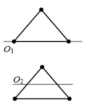
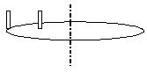

# Демонстрационный вариант контрольной работы № 2

## Тестовая часть

1. Три маленьких шарика расположены в вершинах правильного треугольника. Момент инерции этой системы относительно оси \\(O_{1}\\),
проходящей через два шарика, -  \\(I_{1}\\). Момент инерции
этой системы относительно оси \\(O_{2}\\), проходящей через середины двух
соседних сторон треугольника, - \\(I_{1}\\).  
Среди приведенных ниже соотношений между моментами инерции системы относительно данных осей выберите верное.

 

$$А)I_{1}>I_{2};\qquad Б) I_{1}=I_{2}; \qquadВ) I_{1}<I_{2}. $$

2.  Два диска с равными массами и радиусами \\(R_{1}\\) и \\(R_{2}\\)
(\\(R_{1}=2R_{2}\\)) раскручивают из состояния покоя до одинаковых угловых скоростей. Найдите отношение совершенных работ
\\(A_{1}/A_{2}\\).
$$А)2;\qquad Б) 4; \qquad В) 1/2 \qquad Г) 1/4.$$

3.  Человек массы *m* стоит на краю
горизонтального однородного диска массы *M* и радиуса *R*, который свободно вращается с угловой скоростью \\(\omega_{0}\\).
Человек переместился на расстояние *R/2* к центру диска и остановился (см. рис. 2). Пренебрегая размерами человека,
найдите угловую скорость диска после перемещения человека.

 

 
  $$А)\omega=\omega_{0}\frac{M+2m}{M+m/2}; Б) \omega=\omega_{0}\frac{M+2m}{M+m};  В) \omega=\omega_{0}\frac{M+2m}{M}.$$

4. Шар и сплошной цилиндр одинаковой массы и радиуса катятся без скольжения по горизонтальной поверхности с одинаковой скоростью. Кинетическая энергия шара меньше кинетической энергии цилиндра
    
    А) в 1,05 раза;  Б) в  1,07 раза;    
    В) в 1,10 раза; Г) в 1,25 раза.

5.  Импульс релятивистской частицы \\(p=mc\\). Определите
    отношение скорости частицы к скорости света в вакууме.

6.  Скорость релятивистской частицы массой *m* равна *V =* 0,6 *c*.
    Кинетическая энергия частицы

   $$А)T=2mc^{2}/3;\qquad Б) T=mc^{2}/4;$$
   $$В)T=mc^{2};\qquad Г) T=5mc^{2}/4;$$

7.  Материальная точка массы *m* = 10 г совершает колебания по закону
    \\(x=0,02sin(\frac{\pi}{2}t+\frac{\pi}{4})\\) (*x*, *t* - в единицах СИ). Максимальная
    сила, действующая на точку, равна

     А)   49 мН;      Б)    20 мН;       В)      0,31 мН;       Г)    0,49 мН.
 

8.  Гармонический осциллятор совершает колебания. Какие из перечисленных
    ниже величин достигают максимального значения в момент прохождения
    грузом положения равновесия: скорость v, ускорение *a*, квазиупругая
    сила *F*, кинетическая энергия *T*, потенциальная энергия *U*?

     А)   v, *F*, *U* ;   Б)   v, *F*, *T*;  В)   *a*, *F*, *U*; Г)   v, *T*.

9.  Математический маятник совершает колебания по закону
    \\(x=0,004cos(2t+0,8)\\) (*x*, *t* - в единицах СИ). Длина нити
    маятника равна

    А)   4 м ;     Б)   3,25 м ;   В)   2,45 м ;     Г)   0,25 м ;    А)   4 м.

10. Какова амплитуда колебания, получающегося при сложении следующих
    гармонических колебаний одного направления: \\(x_{1}=Asin2\pi\nut\\), \\(x_{1}=Asin(2\pi\nut+2\pi/3)\\)?

    А)    *A* ;       Б)   2*A* ;      В)    *A*/2:        Г)    *A*/3.

11. Расстояние между пучностью и ближайшим к ней узлом стоячей волны
равно 20 см. Длина волны равна

    А)   0,2 м;     Б)   0,4 м;     В)   0,8 м;    Г)    0,3 м;    Д)    0,1 м.

12. В ходе некоторого равновесного процесса температура, объем и
    давление идеального газа связаны соотношениями

  $$T^{2}V=const, \qquad p \sim T^{n}.$$
   & nbspМасса газа постоянна. Найдите значение *n*.

 & nbspА)   -3;      Б)   -1;    В)   -2;       Г)   -1/2;       Д)     3.
 

## Задача

13. Тонкий обруч, повешенный на вбитый горизонтально в стену гвоздь,
    совершает малые колебания в плоскости, параллельной стене. Радиус
    обруча *R* = 30 см. Определите период *T* колебаний обруча.

## Ответы

+----------------+-------------+----------------+----------------------+
| **Номер        | #### Ответ  | **Номер        | #### Ответ           |
| задания**      |             | задания**      |                      |
+================+=============+================+======================+
| 1              | А           | 8              | Г                    |
+----------------+-------------+----------------+----------------------+
| 2              | Б           | 9              | В                    |
+----------------+-------------+----------------+----------------------+
| 3              | А           | 10             | А                    |
+----------------+-------------+----------------+----------------------+
| 4              | Б           | 11             | В                    |
+----------------+-------------+----------------+----------------------+
| 5              | 1/\sqrt{2}  | 12             | Д                    |
+----------------+-------------+----------------+----------------------+
| 6              | Б           | 13             |   1,1 с              |
+----------------+-------------+----------------+----------------------+
| 7              | Г           |                |                      |
+----------------+-------------+----------------+----------------------+
