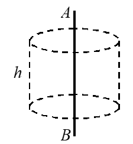
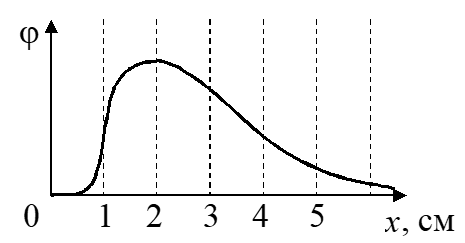
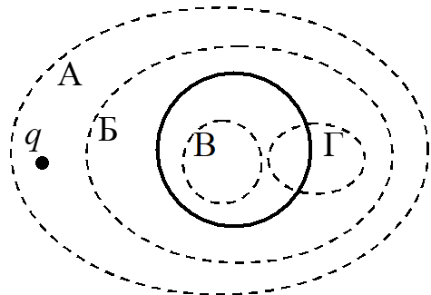
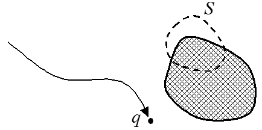
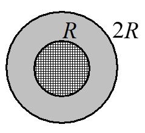

# 
Демонстрационный вариант контрольной работы № 1

***
1-1
***

***
Закон Кулона. Напряженность электрического поля. Теорема Гаусса
***

**1.**

  
  В точку _A_, расположенную вблизи неподвижного заряженного тела, поместили пробный заряд \\(q_{1}\\)_ и измерили действующую на него силу
  \\({\overrightarrow{F}}_{1}\\): \\(F_{1x}\\) = 3 мкН,
  \\(F_{1y} =\\) 4 мкН, \\(F_{1z} = 0\\). Затем заряд \\(q_{1}\\)
  убрали на большое расстояние, поместили в точку _A_ другой пробный
  заряд \\(q_{2}\\) и измерили проекцию действующей на него силы:
  \\(F_{2x} = \\) - 9 мкН. Определите отношение \\(q_{2}/q_{1}\\).

 

**2.**

  
  Точечные заряды \\(-q\\) и \\(2q
  \\) расположены в вершинах _A_ и _B_
  прямоугольного равнобедренного треугольника _АВС_ (_С_ - вершина
  прямого угла). Во сколько раз уменьшится модуль вектора напряженности
  электрического поля в точке _C_, если заряд \\(-q\\) убрать?

  

**3.**
  
  На рис. 1 изображен равномерно заряженный стержень _AB_ длиной _l_ и
  зарядом _Q_, а также воображаемая замкнутая поверхность в виде прямого
  цилиндра высотой _h_. Найдите поток вектора напряженности электрического поля через эту
  поверхность.

**4**.

 При помощи теоремы Гаусса можно рассчитать напряженность электрического поля однородно заряженных    
 А) шара;   
 Б) бесконечно длинной нити;  
 В) кольца.                                                

***
1-2
***

***
Потенциал. Проводники в электрическом поле. Диэлектрики
***

 **5.**

  Чтобы медленно переместить пробный заряд _q_ = -100 нКл из точки 1 
  электростатического поля в точку 2 нужно совершить работу
  \\(A_{12}\\) = 100 нДж. Определите потенциал в точке 1, если потенциал в
  точке 2 равен нулю.

 **6**.

В точках, лежащих на оси _X_, потенциал некоторого электростатического поля зависит от координаты _x_, как показано на рис. 2. В какой точке проекция вектора напряженности на ось _X_ максимальна по модулю?

 А)    _x_ = 1 см;
 Б)    _x_ = 2 см;
 В)    _x_ = 3 см;
 Г)    _x_ = 0.

**7.**

 Какие из приведенных ниже формул для потенциала соответствуют одному и тому же электростатическому полю?

А) $$\phi=A\ln(B/\sqrt{x^{2}+y^{2}});$$  Б) $$\phi=2A\ln(B/\sqrt{x^{2}+y^{2}});$$                    В) $$\phi=A\ln(2B/\sqrt{x^{2}+y^{2}}).$$            

**8.**

  Вблизи
  положительно заряженного металлического шара находится положительный
  точечный заряд _q_. Через какие замкнутые поверхности (одну или
  несколько) поток вектора напряженности электрического поля равен нулю?

**9.**

 Как изменятся потоки векторов напряженности \\(\overrightarrow{E}\\) и индукции \\(\overrightarrow{D}\\) электрического поля через замкнутую поверхность _S_, которая охватывает часть наэлектризованного трением диэлектрика, если к диэлектрику поднести положительный точечный заряд?

А) поток вектора \\(\overrightarrow{E}\\) изменится, поток вектора \\(\overrightarrow{D}\\) не изменится; 
Б) поток вектора \\(\overrightarrow{D}\\) изменится, поток вектора \\(\overrightarrow{E}\\) не изменится;  
В) оба потока изменятся;  
Г) оба потока не изменятся.

 **10.**

 1\) Сформулируйте закон сохранения электрического заряда. 
 2\) Запишите теорему Гаусса для вектора напряженности электрического поля. 
3\) Сформулируйте принцип суперпозиции электрических полей. 
4\) Запишите определение вектора поляризации. 

***
1-3
***

***
Конденсаторы. Энергия электрического поля. Электрический ток
***

**11.**

 Если радиус каждой обкладки сферического конденсатора увеличить в 2 раза, то емкость конденсатора   

 А) увеличится; 
 Б) уменьшится; 
 В) не изменится; 
 Г) может как увеличится, так и уменьшится в зависимости от радиуса внутренней обкладки.

**12.**

 В вершинах равностороннего треугольника со стороной _a_ расположены точечные заряды _-q_, +2_q_ и +2_q_. Энергия взаимодействия этих зарядов равна

 А) 0; 
 Б) \\(\frac{{kq}^{2}}{a}\\); 
 В) \\(\frac{{4kq}^{2}}{a}\\); 
 Г) \\(\frac{{2kq}^{2}}{a}\\);    

**13**.

Ток в проводе увеличивается со временем _t_ по закону   \\(I = {\alpha t}^{2}\\), где \\(\alpha\\) - известная постоянная. За время от \\(t_{1}\\) = 0 до \\(t_{2} = \tau\\) через сечение провода пройдет заряд 

 А) \\(q = {ατ}^{3}/3\\);  
 Б) \\(q = {ατ}^{2}S\\), где _S_ - площадь сечения;  
 В) \\(q = {ατ}^{3}.\\) 

**14.**

 На рис. 5 показано поперечное сечение провода, изготовленного из двух различных проводников: внутреннего цилиндрического проводника радиуса _R_ и внешнего проводника в виде цилиндрического слоя. Если при \\(r < R\\) модуль вектора плотности тока равен \\(j_{1}\\), а при \\(R < r < 2R\\) равен \\(j_{2}\\) (_r_ - расстояние от оси симметрии провода), то величина тока через сечение провода равна

 А) \\(I=\pi R^{2}(j_{1}+j_{2});\\) 
 Б) \\(I=\pi R^{2}(j_{1}+2j_{2});\\) 
 В) \\(I=\pi R^{2}(j_{1}+3j_{2}).\\)

**15.**

Определите работу электрических сил при уменьшении в 2 раза радиуса
однородно заряженной сферы. Заряд сферы _q_, ее первоначальный радиус
_R_.

***
Ответы
***

 1. -3                                                 |
 2. \\(\sqrt{5}\\)/2
 3. \\(Ф=Qh/\epsilon_{0}l\\)
 4. А, Б 
 5. 1 В                                         
 6. А  
 7. А, В 
 8. В 
 9. А 
 10. см. конспект лекций  
 11. А 
 12. А                  
 13. А 
 14. В
 15. \\(A=- \frac{q^{2}}{8\pi \epsilon_{0}}\\)

