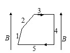

# Демонстрационный вариант контрольной работы № 2

***
2-1
*** 
***
Закон Био-Савара. Теорема о циркуляции вектора \\(\overrightarrow{B}\\) . Сила Ампера 
***

**1.** 

 В формуле \\( d \vec{B} = \frac{\mu_0 I}{4 \pi} \frac{[d \vec{l} \vec{r}]}{r^3} \\), выражающей закон Био и Савара, вектор \\( d \vec{l} \\) означает

   А) элемент провода с током, который создает поле \\( d \vec{B} \\);  
   Б) элемент провода с током, на который действует сила Ампера;  
   В) элемент произвольного замкнутого контура. 

   **Ответ:** А.

**2.** 

 Воображаемый замкнутый контур, образованный дугой окружности радиуса \\( R \\) и ее диаметром, расположен в вакууме в постоянном однородном магнитном поле, вектор \\( \vec{B} \\) индукции которого составляет угол \\( \alpha \\) с диаметром. Криволинейный интеграл \\( \Gamma = \int \vec{B} d \vec{l} \\) вдоль дуги окружности 1-2-3 равен

 

   А) \\( 2 \pi R B \cos \alpha \\);   
   Б) \\( 2 R B \cos \alpha \\);   
   В) \\( \pi R B \sin \alpha \\);   
   Г) \\( 2 R B \sin \alpha \\).  

   **Ответ:** Б.

**3.** 

Имеется длинный прямой провод круглого сечения радиуса \\( R \\), по которому течет ток \\( I \\), однородно распределенный по сечению. Воображаемый контур представляет собой окружность радиуса \\( r < R \\), плоскость которой перпендикулярна оси провода, а центр лежит на этой оси. Циркуляция вектора индукции магнитного поля по этому контуру равна

   А) \\( \mu_0 I (r / R)\\);   
   Б) \\( \mu_0 I (r / R)^2 \\);   
   В) \\( \mu_0 I (r / R)^3 \\).  

   **Ответ:** Б.

**4.** 

В однородном магнитном поле \\( B \\) находится контур с током, показанный на рисунке. Стороны 1, 2 и 3 имеют одинаковые длины. Запишите силы \\( F_1, F_2, F_3, F_4, F_5 \\), действующие со стороны магнитного поля на соответствующие стороны контура, в порядке возрастания их величин, начиная с наименьшей.

   **Ответ:** \\( F_4, F_1, F_2, F_3, F_5 \\).

***
2-2
***  
***
Электромагнитная индукция. Самоиндукция 
***

**5.** 

На рисунке изображен круговой проводящий контур, помещенный в однородное магнитное поле, вектор индукции \\( \vec{B} \\) которого направлен от нас перпендикулярно плоскости чертежа. Индукционный ток в контуре протекает по часовой стрелке, если

   А) величина \\( B \\) растет;   
   Б) контур растягивается;   
   В) величина \\( B \\) убывает;   
   Г) контур сжимается.  

   **Ответ:** В, Г.

**6.** 

В однородном магнитном поле с индукцией \\( \vec{B} \\) расположен П-образный проводник, плоскость которого перпендикулярна вектору магнитной индукции. По проводнику со скоростью \\( V \\) перемещают поступательно жесткую проводящую перемычку. В каких случаях ЭДС индукции в замкнутом контуре равна \\( |\xi| = BVl\\)?

   А) 
   Б) 
   В) 

   **Ответ:** А, Б, В.

**7.** 

Укажите ошибочное утверждение:

   А) изменение тока в контуре ведет к возникновению ЭДС индукции в этом же самом контуре, такое явление называется самоиндукцией;  
   Б) явление самоиндукции обусловлено действием магнитной составляющей силы Лоренца на носители тока в проводнике;  
   В) явление самоиндукции обусловлено действием вихревого электрического поля на носители тока в проводнике;  
   Г) самоиндукцию следует рассматривать как одно из проявлений электромагнитной индукции — ЭДС самоиндукции определяется формулой \\( \xi = -d \Phi / dt \\).  

   **Ответ:** Б.

**8.** 

Квадратная рамка со стороной \\( a \\), изготовленная из тонкой проволоки сопротивлением \\( R \\), находится в однородном магнитном поле, величина индукции которого зависит от времени по закону \\( B = A t + D \\), где \\( A \\) и \\( D \\) — постоянные. Вектор магнитной индукции составляет угол \\( \alpha \\) с нормалью к плоскости рамки. Определите зависимость индукционного тока в рамке от времени.

   А) \\( I(t) = \frac{2 a^2 A}{R} \sin \alpha \\)  
   Б) \\( I(t) = \frac{a^2 A}{R} \cos \alpha \\)  
   В) \\( I(t) = \frac{a^2 (A t + D)}{t R} \cos \alpha \\)  
   Г) \\( I(t) = \frac{a^2 (A t + D)}{t R} \sin \alpha \\)  

   **Ответ:** Б.

***
2-3
***   
***
Электрические колебания. Электромагнитные волны 
***

**9.** 

За миллисекунду амплитуда колебаний тока в колебательном контуре уменьшилась от \\( I_0 = 5,4 \\) мА до \\( I_1 = 2 \\) мА. Чему равен коэффициент затухания \\( \beta \\) колебаний?

   **Ответ:** \\( 1000 \ \text{с}^{-1} \\).

**10.** 

Магнитное поле порождают

   А) постоянные токи;   
   Б) переменные токи;  
   В) движущиеся заряды;   
   Г) постоянное во времени неоднородное электрическое поле;   
   Д) переменное во времени электрическое поле.  

   **Ответ:** А, Б, В, Д.

**11.**

Укажите ошибочное утверждение, относящееся к плоской электромагнитной волне, распространяющейся в вакууме:

   А) скорость волны равна \\(c = 1 /\sqrt{\epsilon_{0}\mu_{0}}\\), где \\(\varepsilon_0 \\) и \\( \mu_0 \\) — электрическая и магнитная постоянные;   
   Б) в электромагнитной волне в любой момент времени векторы \\( \vec{E}, \vec{B} \\) и \\( \vec{k} \\) (волновой вектор) взаимно перпендикулярны;   
   В) в фиксированной точке пространства \\( \vec{E} = \vec{E}_m \cos (\omega t + \alpha), \quad \vec{B} = \vec{B}_m \sin (\omega t + \alpha) \\);   
   Г) \\( \vec{E} = \vec{E}_m \cos (\omega t - \vec{k} \vec{r} + \alpha_0) \\), где \\( \|\vec{k}\| = 2 \pi / \lambda, \lambda \\) — длина волны. 

   **Ответ:** В.

**12.**  

Катушку подключили к источнику синусоидального напряжения постоянной амплитуды. С ростом частоты амплитуда тока через катушку

   А) увеличивается;  
   Б) уменьшается;   
   В) не изменяется;   
   Г) может как увеличиваться, так и уменьшаться.  

   **Ответ:** Б.

***
2-4
*** 
***
Поляризация. Интерференция. Дифракция
***

**13.** 

Угол между плоскостями пропускания двух идеальных поляризаторов \\( \alpha_1 = 45^\circ \\). Как изменится интенсивность прошедшего через них света, если этот угол уменьшить в 1,5 раза?

   А) уменьшится в \\( \sqrt{3} \\) раза;   
   Б) уменьшится в 1,5 раза;   
   В) увеличится в 1,5 раза;   
   Г) увеличится в 2 раза.  

   **Ответ:** В.

**14.** 

Свет падает на тонкую пленку с показателем преломления \\( n \\), большим, чем показатель преломления окружающей среды. Оптическая разность хода лучей на выходе из тонкой пленки равна

   А) \\( \Delta l = n (AB + BC) - \left( CD + \frac{\lambda}{2} \right) \\);   
   Б) \\( \Delta l = BC + CD + BM \\);  
   В) \\( \Delta l = BC + CD - BM \\);   
   Г) \\( \Delta l = n (BC + CD) - BM \\). 

   **Ответ:** Г.

**15.** 

Фазы колебаний, возбуждаемых в точке наблюдения двумя соседними зонами Френеля

   А) совпадают;  
   Б) отличаются на \\( \pi / 2 \\);  
   В) отличаются на \\( \pi \\);   
   Г) отличаются на \\( 2 \pi \\) .

   **Ответ:** В.

**16.** 

Во сколько раз увеличится расстояние между соседними интерференционными полосами на экране в опыте Юнга, если зеленый светофильтр (\\( \lambda_1 = 0,50 \ \text{мкм} \\)) заменить красным (\\( \lambda_2 = 0,65 \ \text{мкм} \\))?

   **Ответ:** \\( \frac{\lambda_2}{\lambda_1} = 1,3 \\).